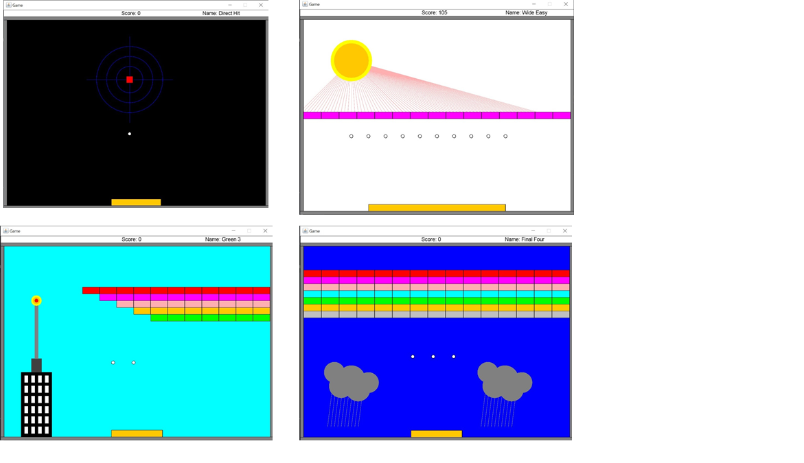

# Arkanoid
Arkanoid Game - written in java.

The game contains four levels with different difficulty.

### interfaces
Animation - An Animation interface. Has two functions- "doOneFrame" that put the changes in the drawsurface and and "shouldStop" that indicates to stop the animation.

Sprite: interface of Sprite. An object that can be drawen on a DrawSurface.

HitNotifier: interface of Hit Notifier.

HitListener: interface of Hit Listener.

LevelInformation: An interface of level information.

Collidable: A collidable interface. An object that other objects can collide it.

### Geometry
Line: Represents a line that contains two points one start and one end.

Point: Represents a point that contains x and y.

Rectangle: A Rectangle that contains upperLeft Point, width and height.

### Sprites
Classes that implements Sprite interface:

Block: A block that contains a rectangle and a color, implements Collidable, Sprite, HitNotifier.

Paddle: A paddle that contains a rectangle, color and keyboard sensor.

Ball: A ball that contains his location and radius and functions of set to his fields and move his location.

ScoreIndicator: a score indicator that displays the score.

### Listeners

Classes that implements HitListener interface:

BlockRemover: a BlockRemover is in charge of removing blocks from the game, as well as keeping count of the number of blocks that remain.

BallRemover: a BallRemover is in charge of removing balls from the game, as well as keeping count of the number of balls that remain.

ScoreTrackingListener: a score tracking listener that updates the score after each hit by increasing 5 points.

### Levels
Classes that implements LevelInformation interface:

DirectHit: Level one.

WideEasy: Level two.

Green3: Level three.

FinalFour: Level four.

### Backgrounds
Classes that implements Sprite interface:

BackGround1: A sprites backGround.

BackGround2: A sprites backGround.

BackGround3: A sprites backGround.

BackGround4: A sprites backGround.

### Screens
Classes that implements animation interface:

PauseScreen: A pause screen that pauses the game until space is pressed.

EndScreen - A screen that appears at the end of the game.

KeyPressStoppableAnimation: A key press stoppable for animation, holds an animation that is keyPressStoppable.

### Game Settings

SpriteCollection: A Sprite Collection that contains a list of sprites.

GameEnvironment: game environment that contains a collidable list and finds collisions with them and the balls.

AnimationRunner: An animation runner.

CollisionInfo: collision info that contains collision point and collision object.

GameFlow: A game flow that runs the levels.

GameLevel: A game level that contains a sprite collection, environment, GUI, colors array and sleeper. runs a game that displays blocks pedals and balls.

LevelName: Defines the level name.

Counter: Counts the points in the game.

Velocity: A velocity that contains dx and dy.

PrintingHitListener: Print a meesage when the ball hit a block.

### Design Patterns
Observer-Observable: in the game the Block is the observable and BlockRemover, BallRemover and ScoreTrackingListener are that observers.

Polymorphism: There are interfaces and diffrent types for each interface.
